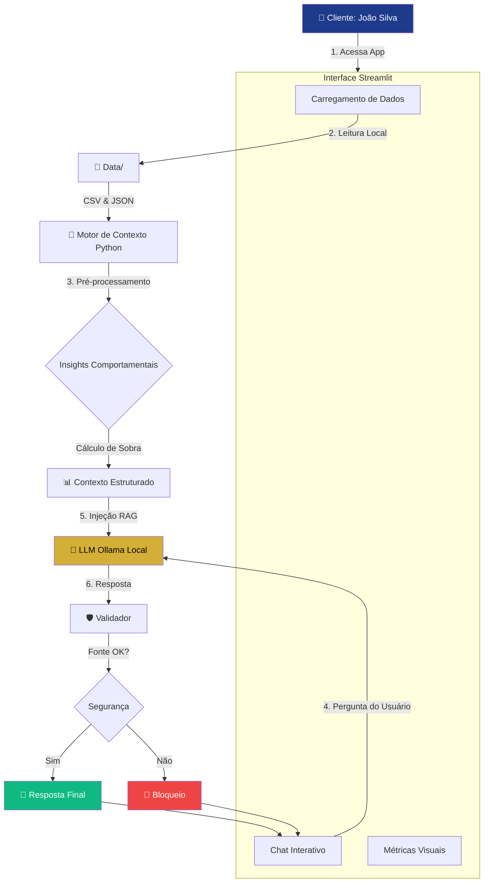

# Assets

Esta pasta é destinada a recursos visuais do seu projeto:

## 🏗️ Arquitetura da Nina

```mermaid
flowchart TD
    A[👤 Cliente: João Silva] -->|1. Acessa App| B[🖥️ Interface Streamlit]
    
    subgraph B [Interface Streamlit]
        B1[Carregamento de Dados]
        B2[Chat Interativo]
        B3[Métricas Visuais]
    end
    
    B1 -->|2. Leitura Local| C[📁 Data/]
    C -->|CSV & JSON| D[🐍 Motor de Contexto Python]
    
    D -->|3. Pré-processamento| E{Insights Comportamentais}
    E -->|Cálculo de Sobra| F[📊 Contexto Estruturado]
    
    B2 -->|4. Pergunta do Usuário| G[🤖 LLM Ollama Local]
    F -->|5. Injeção RAG| G
    
    G -->|6. Resposta| H[🛡️ Validador]
    H -->|Fonte OK?| I{Segurança}
    
    I -->|Sim| J[📝 Resposta Final]
    I -->|Não| K[🚫 Bloqueio]
    
    J --> B2
    K --> B2
    
    style A fill:#1E3A8A,color:#fff
    style G fill:#D4AF37,color:#000
    style J fill:#10B981,color:#fff
    style K fill:#EF4444,color:#fff
```
